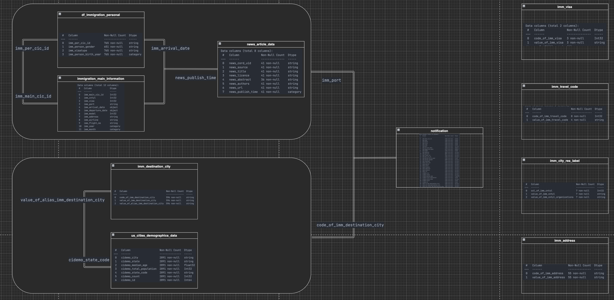

# Udacity Data Engineer Nanodegree - Capstone Project


<font size="2"> Reference unsplash Mika Baumeister </font>

## Table of contents

- [Scope the Project and Gather Data](#step-1-scope-the-project-and-gather-data)
  - [ETL Tools](#etl-tools)
  - [Description Data](#description)

- [Explore and Assess the Data](#step-2-explore-and-assess-the-data)
  - [Accessing the Data](#accessing-the-data)
  - [Accessing the Data Methods](#accessing-the-data-methods)

- [Define the Data Model](#step-3-define-the-data-model)

- [Run ETL to Model the Data](#step-4-run-etl-to-model-the-data)
  - [Introduction](#introduction)
  - [Variables](#variables)
  - [Triggers](#trigger-dags)
  - [Spark Submit](#spark-submit)
    - [Spark Steps](#spark-steps)
    - [AWS EMR Steps (Spark Steps)](#aws-emr-steps-spark-steps)
  - [Job Flow](#job-flow)

- [Complete Project Write Up](#step-5-complete-project-write-up)
  - [Goal](#goal)
  - [ETL Stages](#etl-stages)
  - [Scenarios](#scenarios)

---

> **Local Machine Environment Settings:**
>> 1. Spark: 2.4.8 (Pyspark)
>> 2. Hadoop: 2.7
>> 3. Python: 3.7
>> 4. Java: 8
>> 5. Scala: 2.11


*Purpose for this project*

A health digital company, HealthCare, has decided that it is time to provide more automation and monitoring of COVID-19 news information for their users. In order to complete the ETL pipelines that the best tool to achieve this is Apache Airflow.

They have decided to use the Hadoop ecosystem to process the data on Amazon EMR. The data is stored in the AWS S3 bucket.

The company's data science project team will create high-grade data pipelines that are dynamic and built from reusable tasks, can be monitored, and allow easy backfills.

They have also noted that the data quality plays a big part when analyses are executed on top the data lake and want to run tests against their datasets after the ETL steps have been executed to catch any discrepancies in the datasets.

The source data resides in AWS S3 and needs to be processed in the open website data of the data lake in Amazon EMR. The source datasets consist of news, immigration, and city demographics data that was sent about airports, and pandemic news for each user after the data team got legal web open data.


### Step 1: Scope the Project and Gather Data
- This project data integrated immigration, news, and us cities' demographics.

#### ETL Tools
**Local Machine**
  - Spark, Hadoop
  - Python pandas
  - Apache Airflow
    - Airflow UI
      - Airflow Variables
      - Airflow DAGs
      - Airflow Aws Operator
      - Airflow Postgres Operator
      - Airflow S3 Operator
      - Airflow EMR Operator
        - Airflow create AWS EMR cluster
        - Airflow Add EMR Steps
        - Airflow watch EMR cluster
        - Airflow terminate EMR cluster
      - Airflow Xcom
      - Jinja2 Template

**Cloud: AWS**
  - EMR
    - ReleaseLabel: emr-5.36.0
    - InstanceType: m5.xlarge
    - InstanceRole: one master, two cores
  - S3

#### Description Datasets
| Source                  | Data Set Description                                                                                                                                                                                                                                                                                                                                                                    |
|-------------------------|-----------------------------------------------------------------------------------------------------------------------------------------------------------------------------------------------------------------------------------------------------------------------------------------------------------------------------------------------------------------------------------------|
| [*i94*](https://www.trade.gov/national-travel-and-tourism-office)                     | This data comes from the US National Tourism and Trade Office. A data dictionary is included in the workspace.   This  is where the data comes from. There's a sample file so you can take a look at the data in csv format before reading it all in. You do not have to use the entire dataset, just use what you need to accomplish the goal you set at the beginning of the project. |
| [*News*](https://www.kaggle.com/datasets/allen-institute-for-ai/CORD-19-research-challenge?select=metadata.readme)                    | In response to the COVID-19 pandemic, the White House and a coalition of leading research groups have prepared the COVID-19 Open Research Dataset (CORD-19). CORD-19 is a resource of over 1,000,000 scholarly articles, including over 400,000 with full text, about COVID-19, SARS-CoV-2, and related coronaviruses.                                                                                                                                                                                                                                                                                                                                                             |
| [*US Cities: Demographics*](https://public.opendatasoft.com/explore/dataset/us-cities-demographics/export/) | This dataset contains information about the demographics of all US cities and census-designated places with a population greater or equal to 65,000.                                                                                                                                                                                                                                    |
---
### Step 2: Explore and Assess the Data
#### Access the Data
- i94 immigration data folder
  - included 12 months of 2016
  - sas data format
  - one label sas file for mapping

- News Metadata
  - csv data format

- US Cities Demographics
  - csv data format

#### Access the Data Methods
- SAS Data Format
  - Pyspark:
     read data using -> pachage: saurfang:spark-sas7bdat:2.0.0-s_2.11
- CSV Data Format
  - Pyspark:
     read data using -> read.options(header=True, delimiter=';').csv()


Please Refer to: [Capstone Project access data on local machine](aws_emr_steps/Explore_and_Assess_the_Data.ipynb)
<font size="2"> *This .Ipynb file was working on the local machine, so it should be modified parameters when use on AWS EMR and AWS S3.* </font>

---
### Step 3: Define the Data Model
> This project data model was designed star schema. It was separated from source data to 9 dimension tables and one fact table.

<p align="center">
  
</p>


---
### Step 4: Run ETL to Model the Data

*Udacity Capstone - ETL Workflow*

<p align="center">
  
</p>


#### Introduction
In this project, I created two triggers for uploading data when I finished downloading all source data from Kaggle or Udacity.

I created a dag and named delete xcom for deleting upload data tasks when I rerun airflow each time. This step for confirming my watch step dag certainly gets the latest step id from the AWS EMR cluster.

Combine two dags for automation and monitoring to control more data transfer information. It means I want to design a scenario in that dags are more than one, so I can use airflow to monitor multiple tasks more convenient.

Use EMR Operators for automatic and monitored my AWS EMR cluster status and terminate when all tasks are completed. It's for controlling AWS EMR cluster runtime cost not over printing.


#### Variables
- Variables are a generic way to store and retrieve arbitrary content or settings as a simple key-value store within Airflow.

```json
// Import below json file in Airflow Variables
{
    "Bootstrap_Bucket": "mywsbucketbigdata",
    "Ec2_Key_Pair_Name": "my-key-pair",
    "Ec2_Subnet_Id": "subnet-XXXXXXXXX",
    "Job_Flow_Role": "EMR_EC2_DefaultRole",
    "Log_Bucket": "mywsbucketbigdata",
    "Data_Bucket": "mydatapool",
    "Service_Role": "EMR_DefaultRole",
    "Postgres_conn_DB": "airflow_db"
}
```
- Variables can be listed, created, updated, and deleted from the UI (Admin -> Variables), code, or CLI.
<p align="center">
  
</p>


#### Trigger DAGS

<span style="color:blue">*Trigger 1: Upload Source data from Local to AWS S3*</span>

<p align="center">
  
</p>


<span style="color:blue">*Trigger 2: Upload etl_emr script from Local to AWS S3*</span>

<p align="center">
  
</p>

#### Spark Submit
- The main of this step is executing the etl_emr script for completing the ETL data process and then residing in AWS S3.
> ➡️ **packages saurfang:spark-sas7bdat:2.0.0-s_2.11** <br>
>  [*HINT*]: This config will be automated download jar package.

##### Spark Steps
```python
SPARK_STEPS = [
    {
        "Name": "For Dealing with data and analytics using Spark on AWS EMR",
        "ActionOnFailure": "CONTINUE",
        "HadoopJarStep": {
            "Jar": "command-runner.jar",
            "Args": [
                "spark-submit",
                "--packages",
                "saurfang:spark-sas7bdat:2.0.0-s_2.11",
                "--deploy-mode",
                "client",
                "s3://{{ var.value.Data_Bucket }}/upload_data/script/data_spark_on_emr.py",
            ],
        },
    }
]
```
##### AWS EMR Steps (Spark Steps)
<p align="center">
  
</p>

#### Job Flow
- This Job Flow can be created AWS EMR Cluster

```python
JOB_FLOW_OVERRIDES = {
    "Name": "Udacity_Capstone_ETL_On_EMR",
    "ReleaseLabel": "emr-5.36.0",
    "Applications": [
        {
            "Name": "Hadoop"
        },
        {
            "Name": "Spark"
        }
    ],
    "BootstrapActions": [
        {
            "Name": "bootstrap_emr",
            "ScriptBootstrapAction": {
                "Path": "s3://{{ var.value.Bootstrap_Bucket }}/bootstrap_emr.sh"
            }
        }
    ],
    "Configurations": [
        {
            "Classification": "spark-env",
            "Configurations": [
                {
                    "Classification": "export",
                    "Properties": {
                        "PYSPARK_PYTHON": "/usr/bin/python3"
                    }
                }
            ]
        }
    ],
    "Instances": {
        "Ec2KeyName": "{{ var.value.Ec2_Key_Pair_Name }}",
        "Ec2SubnetId": "{{ var.value.Ec2_Subnet_Id }}",
        "InstanceGroups": [
            {
                "InstanceCount": 1,
                "InstanceRole": "MASTER",
                "InstanceType": "m5.xlarge",
                "Market": "ON_DEMAND",
                "Name": "Primary_Node"
            },
            {
                "InstanceCount": 2,
                "InstanceRole": "CORE",
                "InstanceType": "m5.xlarge",
                "Market": "ON_DEMAND",
                "Name": "Core_Node_2"
            }
        ],
        "KeepJobFlowAliveWhenNoSteps": True,
        "TerminationProtected": False
    },
    "JobFlowRole": "{{ var.value.Job_Flow_Role }}",
    "LogUri": "s3://{{ var.value.Log_Bucket }}/emrlogs/",
    "ServiceRole": "{{ var.value.Service_Role }}",
    "VisibleToAllUsers": True
}
```

ETL Main DAG
Please Refer to: [dag_etl_aws_emr](airflow/dags/dag_etl_aws_emr.py)

Trigger: Upload Source from local to AWS S3
Please Refer to: [dag_upload_data_to_aws_s3](airflow/dags/dag_upload_data_to_aws_s3.py)

Trigger: Upload ETL EMR script from local to AWS S3
Please Refer to: [dag_upload_data_to_aws_s3](airflow/dags/dag_upload_data_to_aws_s3.py)

Spark EMR Step
Please Refer to: [dag_upload_emr_script](airflow/dags/dag_upload_emr_script.py)

---
### Step 5: Complete Project Write Up

*Project Infra*
<p align="center">
  
</p>

##### Goal
In my project infrastructure, I try to understand what can I do for a simple project after finished Udacity Course. So I have an idea of how should I predict the spread of the COVID-19 and broadcast the latest news to people who are immigrants, travel, etc.

This application could be more flexible to alert people who are transferring places to the other state. Those messages should not only provide information but also be received by people's location or behavior in our application to rebuild machine learning models before they accepted personal data for use.


##### ETL Stages
In Phase I, I want to integrate source data on the below stages:
> All of the data ETL process be used Airflow and automated monitoring job flow correctly or not.

| Stages | Stage Description                                                                                                                                                                                                                                                                                                                                                                                                                                                                                                          |
|--------|----------------------------------------------------------------------------------------------------------------------------------------------------------------------------------------------------------------------------------------------------------------------------------------------------------------------------------------------------------------------------------------------------------------------------------------------------------------------------------------------------------------------------|
| Stage1 | Upload Source Data from Local Storage to AWS S3                                                                                                                                                                                                                                                                                                                                                                                                                                                                            |
| Stage2 | Upload Config, Bootstrap file from Local Storage to AWS S3                                                                                                                                                                                                                                                                                                                                                                                                                                                                 |
| Stage3 | Upload ETL EMR script from Local Storage to AWS S3                                                                                                                                                                                                                                                                                                                                                                                                                                                                         |
| Stage4 | The ETL EMR script will transform the staging tables into fact and dimension tables.   Consider spark's top feature is a memory compute by cluster, so I transform 9 dimensions and one fact table each table com from more than one million records.    In this project, I'm trying to deal with more complex queries and repartition to AWS S3, but it's almost out of memory errors.    So In my less experience, I will be dealing with more complex business logic in AWS Redshift and building API for user requests. |
| Stage5 | Using AWS EMR Operator to monitor the job flow and terminate when the job is completed.                                                                                                                                                                                                                                                                                                                                                                                                                                    |

#### Scenarios
1. Data was increased by 100x.
 In the AWS EMR cluster, I was distributing more than two slave cores and choosing an automation scale on the elastic instance, it should be more flexible when the data was increased 100x or more. In some detailed config, I modified parameters like executer memory, executer number and shuffle partition, and so on.

2. Pipelines were run on a daily basis by 7am.
  Airflow DAG argument for adjusting timestamp to run on a daily basis by 7 am.

3. The database needed to be accessed by 100+ people.
  In my opinion, If the database needed to be accessed by 100+ people, I should design API for query and each according to business logic that was stored in RMDBS like PG or Spark Hive.
  <p align="center">
    
  </p>